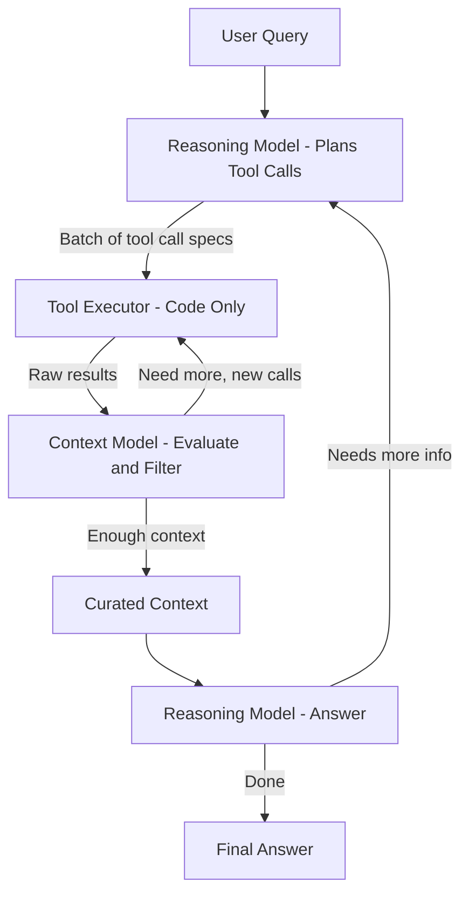

# Aide V1 Architecture Overhaul

## Current State

The system today has three retrieval strategies (`simple`, `tools`, `hybrid`) that share a `RetrievalStrategy` interface. The `tools` strategy guides the model to explore top-down (`list_packages` -> `list_files` -> `search`), which wastes tool calls finding entry points. There is one model role (a single runtime used for everything). Token tracking is minimal (estimates via `TokenBudgetManager` at ~4 chars/token). Context assembly happens in `ContextAssembler` after retrieval.

Key files:

- [src/core/config.ts](src/core/config.ts) -- `AIDE_DEFAULTS`, `ProjectConfig`, `RetrievalSettings`
- [src/models/types.ts](src/models/types.ts) -- `ModelRuntime`, `ToolCapableRuntime`, `EmbeddingRuntime`
- [src/models/modelFactory.ts](src/models/modelFactory.ts) -- `createRuntime`, `createRuntimeFromProjectConfig`
- [src/retrieval/types.ts](src/retrieval/types.ts) -- `RetrievalStrategy`, `RetrievalResult`, `RetrievalConfig`
- [src/retrieval/toolBasedRetrieval.ts](src/retrieval/toolBasedRetrieval.ts) -- agentic tool loop
- [src/retrieval/hybridRetrieval.ts](src/retrieval/hybridRetrieval.ts) -- factory `createRetrievalStrategy`
- [src/context/assembler.ts](src/context/assembler.ts) -- `ContextAssembler`
- [src/brain/sqliteStore.ts](src/brain/sqliteStore.ts) -- `SQLiteBrainStore`
- [src/brain/projectGraph.ts](src/brain/projectGraph.ts) -- `ProjectGraph` interface
- [src/cli/commands/ask.ts](src/cli/commands/ask.ts) -- end-to-end ask flow

---

## Phase 1: Token Tracking Infrastructure

### Goal

Track and log token usage at every phase: system prompts, user messages, tool call inputs/outputs, model responses, and cumulative totals.

### Design

Create a new `TokenTracker` class in `src/core/tokenTracker.ts`:

```typescript
interface TokenEvent {
  phase:
    | 'system_prompt'
    | 'user_message'
    | 'tool_call'
    | 'tool_result'
    | 'model_response'
    | 'context_assembly';
  modelRole: 'reasoning' | 'context' | 'embedding';
  label: string; // e.g., "search(auth)" or "reasoning model call #2"
  inputTokens: number;
  outputTokens: number;
  cumulativeInput: number;
  cumulativeOutput: number;
  timestamp: number;
}

class TokenTracker {
  private events: TokenEvent[] = [];
  record(phase, modelRole, label, input, output): void;
  getCumulativeInput(): number;
  getCumulativeOutput(): number;
  getTotal(): number;
  getByRole(role): { input: number; output: number };
  getSummary(): string; // formatted log with per-role and per-phase breakdown
  getEvents(): TokenEvent[];
}
```

### Changes

- **New file**: `src/core/tokenTracker.ts`
- **Modify** [src/models/cloudModelClient.ts](src/models/cloudModelClient.ts) -- extract `usage` from OpenAI API response (already partially available), return in `ChatResponse`
- **Modify** [src/models/localModelClient.ts](src/models/localModelClient.ts) -- extract `eval_count`/`prompt_eval_count` from Ollama response
- **Modify** [src/models/types.ts](src/models/types.ts) -- add `usage?: { inputTokens: number; outputTokens: number }` to `ChatResponse`
- **Modify** [src/retrieval/toolBasedRetrieval.ts](src/retrieval/toolBasedRetrieval.ts) -- log each tool call and model response through tracker
- **Modify** [src/context/assembler.ts](src/context/assembler.ts) -- log assembled context size
- **Modify** [src/cli/commands/ask.ts](src/cli/commands/ask.ts) and [src/cli/repl.ts](src/cli/repl.ts) -- instantiate tracker, print summary after each query
- **Modify** [src/cli/ui.ts](src/cli/ui.ts) -- add `verbose.tokenSummary()` renderer

The tracker is passed as a dependency (not a global singleton), scoped per-query.

### Verify

Run `aide ask "what does the config module do?"` and confirm token usage summary is printed after the response, showing per-phase and per-model-role breakdown.

---

## Phase 2: Semantic Search / Embedding Infrastructure

### Goal

Build a vector embedding pipeline that works directly from **raw source files** (not from the indexed project graph). This ensures embeddings capture all code even if the project graph has gaps. The project graph is then used to expand context _after_ entry points are found.

### Key Decision: Embeddings from Raw Files

Embeddings are generated by reading and chunking raw source files directly, **independent of tree-sitter indexing or the project graph**. This means:

- Embeddings work even if no project graph has been built
- Embeddings catch code that tree-sitter might miss (unusual syntax, unsupported languages, config files)
- The project graph is used _after_ finding entry points to expand context via relationships (callers, callees, etc.)

### Embedding Storage

Store embeddings in the same SQLite database (new `embeddings` table). The table does NOT reference `content_blocks` -- it is fully self-contained.

**New table** (added to [src/brain/sqliteStore.ts](src/brain/sqliteStore.ts)):

```sql
CREATE TABLE IF NOT EXISTS embeddings (
  id TEXT PRIMARY KEY,
  file_path TEXT NOT NULL,     -- relative to project root
  content TEXT NOT NULL,        -- the chunk text
  start_line INTEGER NOT NULL,
  end_line INTEGER NOT NULL,
  content_hash TEXT NOT NULL,   -- hash of chunk content (for change detection)
  embedding BLOB NOT NULL,      -- Float32Array serialized
  model TEXT NOT NULL,           -- which embedding model produced this
  created_at TEXT NOT NULL
);
CREATE INDEX idx_embeddings_file ON embeddings(file_path);
CREATE INDEX idx_embeddings_hash ON embeddings(content_hash);
```

### Chunking (Analysis Layer)

**New file**: `src/analysis/chunker.ts` -- part of the analysis/indexing pipeline, NOT retrieval. The chunker reads raw source files and produces chunks that get embedded. It lives alongside the tree-sitter analyzer as another way to analyze code.

```typescript
interface Chunk {
  content: string;
  filePath: string;
  startLine: number;
  endLine: number;
  contentHash: string;
}

interface ChunkerOptions {
  maxTokensPerChunk?: number; // default 512
  overlap?: number; // lines of overlap between chunks, default 2
}

function chunkFile(
  filePath: string,
  content: string,
  options?: ChunkerOptions
): Chunk[];
```

Chunking approach:

1. Split on natural boundaries: function/class declarations (regex-based, not tree-sitter)
2. If a natural chunk exceeds `maxTokensPerChunk`, split at logical line breaks
3. Small adjacent chunks (< 50 tokens) are merged with neighbors
4. Each chunk gets a few lines of overlap with the next for context continuity

### SemanticSearchEngine

**New file**: `src/retrieval/semanticSearch.ts`:

```typescript
interface SemanticSearchResult {
  chunkId: string;
  filePath: string;
  content: string;
  startLine: number;
  endLine: number;
  score: number; // cosine similarity
}

interface SemanticSearchEngine {
  indexProject(
    rootPath: string,
    options?: { filePatterns?: string[]; ignorePatterns?: string[] }
  ): Promise<{ filesIndexed: number; chunksCreated: number }>;
  indexFile(filePath: string, content: string): Promise<void>;
  search(
    query: string,
    options?: SearchOptions
  ): Promise<SemanticSearchResult[]>;
  hasEmbeddings(): boolean;
  getStats(): { totalChunks: number; totalFiles: number };
}

interface SearchOptions {
  topK?: number; // default 10
  minScore?: number; // default 0.3
  filePath?: string; // restrict to file/directory prefix
}
```

**Vector math**: Cosine similarity in pure TypeScript over Float32Arrays. Brute-force is fast enough for typical project sizes (< 50K chunks).

### How the Embedding Model Fits In

The embedding model (`all-minilm:latest`) is a specialized vector model -- it converts text into arrays of numbers (vectors), not chat responses. It is used at two points:

- **At index time** (batch, one-time): Each code chunk produced by the chunker is sent through the embedding model to produce a vector. These vectors are stored in SQLite alongside the chunk content. This happens during `aide init` / `aide reindex`.
- **At query time** (single call per query): The user's natural language question is sent through the same embedding model to produce a query vector. Then cosine similarity (pure math, no model call) compares the query vector against all stored chunk vectors to find the most relevant code.

The embedding model is cheap and fast (< 100ms per batch). It is fundamentally different from the reasoning/context models (which produce text). That is why it is a separate configurable role.

### Embedding Pipeline

1. `aide init` / `aide reindex` triggers embedding generation **after** (or in parallel with) tree-sitter indexing
2. Reads raw files from disk, runs through `chunkFile()` (from `src/analysis/chunker.ts`)
3. Batches chunks and calls `EmbeddingRuntime.embed()`
4. Stores vectors + chunk content in SQLite; uses `content_hash` to skip unchanged chunks on re-index

### Changes

- **New file**: `src/analysis/chunker.ts` -- raw file chunker (analysis layer, alongside tree-sitter)
- **New file**: `src/retrieval/semanticSearch.ts` -- `SemanticSearchEngine` class
- **Modify** [src/brain/sqliteStore.ts](src/brain/sqliteStore.ts) -- add `embeddings` table, upsert/query/delete methods
- **Modify** [src/brain/projectGraph.ts](src/brain/projectGraph.ts) -- add embedding-related methods to interface
- **Modify** [src/project/indexer.ts](src/project/indexer.ts) -- call embedding generation (can run in parallel with tree-sitter)
- **Modify** [src/core/config.ts](src/core/config.ts) -- add embedding config (batchSize, chunkMaxTokens, minScore, topK)

### Verify

Run `aide reindex` on a project. Confirm logs show "Embedding N chunks from M files". Then manually call `searchEngine.search("authentication")` and confirm relevant results come back with scores.

---

## Phase 3: Three Model Roles

### Goal

Define three **required** model roles that are independently configurable: **Reasoning** (high-level planning and answering), **Context** (context gathering, iteration, and relevance evaluation), and **Embedding** (vector embeddings).

**Important naming**: The middle model is called **"context"** (not "execution"), because "execution" is reserved for a future model role that makes code changes. The context model gathers context, iterates on tool call results, and evaluates relevance.

### Design

**New types** in [src/models/types.ts](src/models/types.ts):

```typescript
type ModelRole = 'reasoning' | 'context' | 'embedding';

interface ModelRoleConfig {
  /** High-level planning, answering, and decision-making */
  reasoning: string;
  /** Context gathering, tool call iteration, relevance evaluation */
  context: string;
  /** Vector embedding generation */
  embedding: string;
}
```

**Updated** `ProjectConfig` in [src/brain/types.ts](src/brain/types.ts) -- all 3 models are **required**, no legacy fallback:

```typescript
interface ProjectConfig {
  id: string;
  rootPath: string;
  /** All three model roles -- required */
  models: ModelRoleConfig;
  /** Ollama base URL (for local models) */
  ollamaBaseUrl: string;
  // ... retrieval settings ...
}
```

The old `model` and `embeddingModel` fields are **removed**. All 3 roles must be defined.

**Updated** `AIDE_DEFAULTS`:

```typescript
export const AIDE_DEFAULTS = {
  models: {
    reasoning: 'qwen3-coder:30b',
    context: 'qwen3-coder:30b',
    embedding: 'all-minilm:latest',
  },
  ollamaBaseUrl: 'http://127.0.0.1:11434/api',
  // ...
};
```

**Updated factory** in [src/models/modelFactory.ts](src/models/modelFactory.ts):

```typescript
interface ModelRuntimes {
  reasoning: ToolCapableRuntime;
  context: ToolCapableRuntime;
  embedding: EmbeddingRuntime;
}

function createRuntimes(config: ProjectConfig): ModelRuntimes;
```

### Changes

- **Modify** [src/models/types.ts](src/models/types.ts) -- add `ModelRole`, `ModelRoleConfig`, `ModelRuntimes`
- **Modify** [src/brain/types.ts](src/brain/types.ts) -- replace `model`/`embeddingModel` with required `models: ModelRoleConfig`
- **Modify** [src/models/modelFactory.ts](src/models/modelFactory.ts) -- add `createRuntimes()`, remove `createRuntimeFromProjectConfig()`
- **Modify** [src/core/config.ts](src/core/config.ts) -- update `AIDE_DEFAULTS` with `models` object, update `loadOrCreateProjectConfig`
- **Modify** [src/cli/commands/ask.ts](src/cli/commands/ask.ts) -- use `ModelRuntimes` instead of single runtime
- **Modify** [src/cli/repl.ts](src/cli/repl.ts) -- same
- **Modify** [src/web/server.ts](src/web/server.ts) -- same
- **Modify** [src/retrieval/toolBasedRetrieval.ts](src/retrieval/toolBasedRetrieval.ts) -- accept `ToolCapableRuntime` (the context model)
- **Modify** [src/retrieval/hybridRetrieval.ts](src/retrieval/hybridRetrieval.ts) -- same

### Verify

Run `aide ask "hello"` and confirm logs show: "Reasoning model: qwen3-coder:30b, Context model: qwen3-coder:30b, Embedding model: all-minilm:latest". Confirm the reasoning model is used for the final answer and context model for retrieval tool calls.

---

## Phase 4: Orchestration Loop

### Goal

Replace the current single-model agentic loop with a multi-model orchestration: reasoning model plans tool calls -> code executes them -> context model evaluates results, strips irrelevant context, iterates -> reasoning model gets curated context and answers.

### Architecture



The user query goes directly to the reasoning model. No pre-computed entry points. The reasoning model has `semantic_search` as a tool and decides its own exploration strategy.

### Design

**New file**: `src/orchestration/toolExecutor.ts` -- refactored from `toolBasedRetrieval.ts`:

```typescript
class ToolExecutor {
  constructor(
    graph: ProjectGraph | null,
    searchEngine: SemanticSearchEngine | null
  );

  /** Execute a batch of tool calls. Returns results keyed by call. Pure code, no model. */
  async executeBatch(calls: ToolCallSpec[]): Promise<ToolCallResult[]>;

  /** Get available tools based on what backends exist */
  getAvailableTools(
    hasGraph: boolean,
    hasEmbeddings: boolean
  ): ToolDefinition[];
}
```

Two tool sets depending on what is available:

**Graph tools** (when project graph exists):

- `semantic_search(query, topK?)` -- find entry points
- `search(query, path?, kinds?)` -- symbol + content search on graph
- `get_symbol_context(symbolId)` -- full code for a symbol
- `get_callers(symbolId)` / `get_callees(symbolId)` -- relationships
- `get_file_content(filePath)` -- file content
- `done()` -- finish

**Semantic-only tools** (when no graph, just embeddings):

- `semantic_search(query, topK?)` -- natural language search
- `get_file_content(filePath)` -- read file content
- `get_file_chunk(filePath, startLine, endLine)` -- read specific lines
- `list_files(path)` -- list directory
- `done()` -- finish

Note: `list_packages` is **removed** from both tool sets. Semantic search replaces top-down exploration.

**New file**: `src/orchestration/orchestrator.ts`:

```typescript
interface OrchestratorConfig {
  maxIterations: number; // max context-model loops (default 5)
  maxToolCallsPerBatch: number; // max calls per batch (default 10)
  enableContextStripping: boolean; // context model strips irrelevant results
}

class Orchestrator {
  constructor(
    runtimes: ModelRuntimes,
    toolExecutor: ToolExecutor,
    tracker: TokenTracker,
    config: OrchestratorConfig
  );

  async answer(
    query: string,
    context: OrchestratorContext
  ): Promise<OrchestratorResult>;
}
```

### Flow Details

1. **Reasoning model plans** (1 call): Given user query + list of available tools (including `semantic_search`), outputs a structured `ToolCallPlan` (JSON array of tool calls). The reasoning model decides its own exploration strategy -- it might start with `semantic_search("authentication handler")` to find entry points, or go directly to `get_file_content` if it knows the file from conversation context. The prompt says: _"You are a planning model. You have tools available to explore a codebase. Output a JSON array of tool calls to gather the context needed to answer the user's question. These will be executed by code and evaluated by another model."_
2. **Code executes tool calls** (no model): `ToolExecutor.executeBatch()` runs the calls against the graph / semantic engine. This is pure code -- if any model outputs valid tool call specs, the code can execute them.
3. **Context model evaluates** (1 call): Given the original query + raw results + list of previous calls, the context model decides:

- Is there enough context? -> Package it and mark done.
- Not enough? -> Output NEW tool calls (cannot repeat previous). Previous call keys are listed in prompt.
- For each result: relevant or not? Strip irrelevant results but keep a `ToolCallSummary` of what was stripped and why.
- The prompt says: _"You are a context evaluation model. The reasoning model requested these tool calls. Here are the results. Decide what is relevant to the user's question, strip what is not, and specify any additional tool calls needed. You are handing curated context to the reasoning model."_

1. **Loop**: Steps 2-3 repeat until context model says "enough" or max iterations.
2. **Reasoning model answers** (1 call): Gets the original query + curated context. The prompt includes:

- The relevant context
- A summary of what was stripped: _"The following was also retrieved but deemed not relevant: [summaries]"_
- If reasoning model needs more, it can request another planning round (max 1-2 extra).

### Tool Call Deduplication

- `IterationState.previousCalls` maps `callKey` (tool name + JSON args hash) to results
- Context model prompt lists all previous calls
- Code-level enforcement: duplicate requests return cached result + warning
- Within a single iteration, the context model cannot request calls that were already made in any previous iteration (enforced in prompt AND in code)

### Conversation + Code Context

Both handled through the same orchestration pipeline:

- Reasoning model can plan both code-context and conversation-context tool calls in one batch
- Conversation tools (`get_previous_answer`, `get_recent_messages`, `search_conversation`) are available alongside code tools
- The context model evaluates both types of results for relevance

### Handoff Prompt Clarity

Each model gets an explicit prompt explaining:

- **Who it is**: "You are the [reasoning/context] model"
- **What it received**: "The [reasoning model / user / context model] provided you with..."
- **What to output**: "Output a JSON array of..." or "Output your answer to the user"
- **What constraints apply**: "Do not repeat these previous calls: [...]. Token budget remaining: N"

### Changes

- **New directory**: `src/orchestration/`
- **New file**: `src/orchestration/orchestrator.ts` -- main orchestration loop
- **New file**: `src/orchestration/toolExecutor.ts` -- standalone tool execution (refactored from `toolBasedRetrieval.ts`)
- **New file**: `src/orchestration/types.ts` -- orchestration types (`ToolCallPlan`, `ToolCallSpec`, `IterationState`, `ToolCallSummary`, `OrchestratorConfig`, `OrchestratorContext`, `OrchestratorResult`)
- **New file**: `src/orchestration/prompts.ts` -- all prompt templates for handoffs
- **New file**: `src/orchestration/index.ts` -- exports
- **Modify** [src/retrieval/toolBasedRetrieval.ts](src/retrieval/toolBasedRetrieval.ts) -- extract tool execution logic into `ToolExecutor` (this file may become thinner or eventually deprecated)
- **Modify** [src/cli/commands/ask.ts](src/cli/commands/ask.ts) -- use `Orchestrator` instead of direct retrieval + model call
- **Modify** [src/cli/repl.ts](src/cli/repl.ts) -- same
- **Modify** [src/web/server.ts](src/web/server.ts) -- same

### Verify

Run `aide ask "how does authentication work?"` and confirm:

- Reasoning model receives query and plans tool calls including `semantic_search` (logged with tokens)
- Tool calls execute via code (logged)
- Context model evaluates and may request more calls (logged with tokens)
- Reasoning model answers with curated context (logged with tokens)
- Token summary shows per-role breakdown

---

## Phase 5: Two Retrieval Strategies

### Goal

Define two clearly named, switchable retrieval strategies that replace the current `simple`/`tools`/`hybrid`:

1. `**graph**` (default when project graph exists): Semantic search finds entry points, then project graph tools expand context via relationships.
2. `**semantic**` (default when no graph exists): Pure semantic search with file-level tools, no graph dependency.

### Strategy: `graph` (Graph Retrieval with Semantic Entry Points)

Uses semantic search to find entry points, then the orchestration loop uses **graph tools** to expand:

- `semantic_search` -> finds relevant code chunks
- `search` -> symbol + content search on project graph
- `get_symbol_context`, `get_callers`, `get_callees` -> expand via relationships
- `get_file_content` -> read full files

This is the most powerful strategy: semantic search eliminates the wasteful top-down exploration, and the project graph enables relationship-based expansion that semantic search alone cannot do.

### Strategy: `semantic` (Pure Semantic Retrieval)

Works without any project graph. Uses only:

- `semantic_search` -> natural language code search
- `get_file_content`, `get_file_chunk` -> read files/sections
- `list_files` -> browse directories

This is the fallback when no project graph has been built, but embeddings exist. It is also useful for quick exploration of unfamiliar codebases before a full index is built.

### Strategy Selection

```typescript
type StrategyType = 'graph' | 'semantic' | 'auto';
```

`'auto'` (default): Checks what is available:

- Graph + embeddings -> `graph`
- Embeddings only (no graph) -> `semantic`
- Neither -> error with message to run `aide init`

### Design

**New file**: `src/retrieval/graphRetrieval.ts` -- replaces/renames `toolBasedRetrieval.ts`:

```typescript
class GraphRetrieval implements RetrievalStrategy {
  constructor(
    searchEngine: SemanticSearchEngine,
    runtime: ToolCapableRuntime, // context model
    config: RetrievalConfig,
    budget: TokenBudgetManager
  );
  async retrieve(
    query: RetrievalQuery,
    graph: ProjectGraph
  ): Promise<RetrievalResult>;
}
```

**New file**: `src/retrieval/semanticRetrieval.ts`:

```typescript
class SemanticRetrieval implements RetrievalStrategy {
  constructor(
    searchEngine: SemanticSearchEngine,
    runtime: ToolCapableRuntime, // context model
    config: RetrievalConfig,
    budget: TokenBudgetManager
  );
  async retrieve(
    query: RetrievalQuery,
    graph: ProjectGraph
  ): Promise<RetrievalResult>;
}
```

Both strategies delegate to the `Orchestrator` but provide different tool sets via `ToolExecutor.getAvailableTools()`.

### Changes

- **New file**: `src/retrieval/graphRetrieval.ts`
- **New file**: `src/retrieval/semanticRetrieval.ts`
- **Modify** [src/retrieval/types.ts](src/retrieval/types.ts) -- update `StrategyType` to `'graph' | 'semantic' | 'auto'`
- **Modify** [src/retrieval/hybridRetrieval.ts](src/retrieval/hybridRetrieval.ts) -- update `createRetrievalStrategy` factory for new strategy names
- **Modify** [src/core/config.ts](src/core/config.ts) -- default strategy is `'auto'`
- **Modify** [src/retrieval/index.ts](src/retrieval/index.ts) -- export new strategies
- **Keep** [src/retrieval/toolBasedRetrieval.ts](src/retrieval/toolBasedRetrieval.ts) and [src/retrieval/simpleGraphRetrieval.ts](src/retrieval/simpleGraphRetrieval.ts) -- can remain as internal implementation or be deprecated gradually

### Verify

Run `aide ask` with `--strategy graph` and `--strategy semantic` and confirm:

- `graph` uses semantic entry points then graph expansion tools
- `semantic` uses only semantic search and file tools
- `auto` picks the right one based on what is available
- Switching between them is seamless

---

## Phase 6: Global Configuration Clarity

### Goal

Make token limits, model roles, and strategy selection clearly visible and easily configurable from one place.

### Design

Updated `AIDE_DEFAULTS` in [src/core/config.ts](src/core/config.ts):

```typescript
export const AIDE_DEFAULTS = {
  // === Model Roles (all 3 required) ===
  models: {
    reasoning: 'qwen3-coder:30b', // High-level planning + answering
    context: 'qwen3-coder:30b', // Context gathering, iteration, relevance eval
    embedding: 'all-minilm:latest', // Vector embeddings (Ollama)
  },

  // === Ollama (for local models) ===
  ollamaBaseUrl: 'http://127.0.0.1:11434/api',

  // === Token Limits ===
  tokens: {
    globalBudget: 16000, // Total token budget for assembled context
    maxModelInput: 128000, // Max tokens to send to any model
    reservedForResponse: 4000, // Reserved for model response generation
  },

  // === Retrieval Strategy ===
  strategy: 'auto' as const, // 'auto' | 'graph' | 'semantic'
  maxBlocks: 10,
  maxDepth: 2,
  maxFanout: 5,
  historyMode: 'tools' as 'direct' | 'tools',
  historyLimit: 6,

  // === Orchestration ===
  orchestration: {
    maxIterations: 5, // Max context-model loops
    maxToolCallsPerBatch: 10, // Max tool calls per batch
    enableContextStripping: true, // Context model strips irrelevant results
  },

  // === Embedding ===
  embedding: {
    batchSize: 50, // Chunks per embedding API call
    chunkMaxTokens: 512, // Max tokens per chunk
    chunkOverlapLines: 2, // Lines of overlap between chunks
    minScore: 0.3, // Minimum similarity score threshold
    topK: 10, // Default top-K search results
  },
} as const;
```

Updated `ProjectConfig` in [src/brain/types.ts](src/brain/types.ts):

```typescript
interface ProjectConfig {
  id: string;
  rootPath: string;
  models: ModelRoleConfig; // required -- all 3 roles
  ollamaBaseUrl: string;
  // Optional overrides (fall back to AIDE_DEFAULTS)
  tokens?: Partial<typeof AIDE_DEFAULTS.tokens>;
  strategy?: 'auto' | 'graph' | 'semantic';
  orchestration?: Partial<typeof AIDE_DEFAULTS.orchestration>;
  embedding?: Partial<typeof AIDE_DEFAULTS.embedding>;
  maxBlocks?: number;
  maxDepth?: number;
  maxFanout?: number;
  historyMode?: 'direct' | 'tools';
  historyLimit?: number;
}
```

### Changes

- **Modify** [src/core/config.ts](src/core/config.ts) -- restructure `AIDE_DEFAULTS`, update `getEffectiveSettings`, update `loadOrCreateProjectConfig`
- **Modify** [src/brain/types.ts](src/brain/types.ts) -- update `ProjectConfig`
- **Modify** CLI commands to display active config on startup: which models per role, which strategy, token budget

### Verify

Run `aide` (REPL) and confirm startup shows:

```
Models: reasoning=qwen3-coder:30b, context=qwen3-coder:30b, embedding=all-minilm:latest
Strategy: auto (resolved to: graph)
Token budget: 16000
```

---

## Testing Protocol

Before every test run, always start clean:

```bash
# Clear graph, embeddings, and all sessions
rm -rf ~/.aide/projects/*/brain.db
rm -rf ~/.aide/projects/*/sessions/
```

Then re-index: `aide reindex .`

### Three-Level Quality Tests

Run these in order after each phase is complete. Each level builds on the previous.

**Level 1 -- Codebase Understanding** (basic retrieval quality):
Ask a straightforward code question:

```
aide ask "How does the retrieval system work in this project?"
```

Check: Does the answer reference actual files, functions, and relationships? Are the cited file paths real? Is the token usage reasonable?

**Level 2 -- Bug/Behavior Description** (real-world query, requires finding the right code):
Ask about a specific behavior without naming files or functions:

```
aide ask "When I click on a verbose log, it scrolls me all the way to the bottom of the list unexpectedly"
```

Check: Does the model find the relevant web UI code? Does it identify the likely cause? Does it propose a concrete fix with file paths and line numbers? This tests whether semantic search + graph expansion can find the right code from a vague, user-facing description.

**Level 3 -- Conversation Follow-Up** (context continuity):
Immediately after Level 2 (same session), ask a follow-up:

```
aide ask "Show me how to implement the proposed solution"
```

Check: Does the model remember what it proposed? Does it reference the same files? Does it produce concrete code changes? This tests conversation context retrieval and continuity.

### What to Log During Tests

- Total tokens per role (reasoning, context, embedding)
- Number of tool call iterations
- Which tools were called and in what order
- What context was stripped by the context model (and why)
- Final answer quality (subjective assessment)

---

## Architecture Principles

1. **Loose coupling**: Each component (semantic search, orchestrator, tool executor, model runtimes) communicates through interfaces, not concrete classes.
2. **Strategy pattern**: Retrieval strategies are pluggable via `RetrievalStrategy` interface. Two main strategies: `graph` and `semantic`.
3. **Dependency injection**: `TokenTracker`, `ModelRuntimes`, `SemanticSearchEngine`, `ToolExecutor` are all injected.
4. **Clear handoffs**: Every prompt explicitly states who is speaking, who will receive the output, and what format is expected.
5. **Token awareness**: `TokenTracker` flows through the entire pipeline; every model call and tool execution is logged with per-role breakdown.
6. **Raw-file embeddings**: Embeddings are generated from raw source files, independent of the project graph. This ensures complete coverage and standalone operation.
7. **Graceful fallback**: `auto` strategy picks the best available approach (graph > semantic > error).
8. **Code-executable tool calls**: Tool call specs are structured data that code can execute directly. If any model outputs valid specs, `ToolExecutor` runs them without needing another model.

---

## File Summary

New files:

- `src/core/tokenTracker.ts`
- `src/analysis/chunker.ts`
- `src/retrieval/semanticSearch.ts`
- `src/retrieval/graphRetrieval.ts`
- `src/retrieval/semanticRetrieval.ts`
- `src/orchestration/orchestrator.ts`
- `src/orchestration/toolExecutor.ts`
- `src/orchestration/types.ts`
- `src/orchestration/prompts.ts`
- `src/orchestration/index.ts`

Modified files:

- `src/core/config.ts`
- `src/core/tokenBudget.ts`
- `src/models/types.ts`
- `src/models/modelFactory.ts`
- `src/models/cloudModelClient.ts`
- `src/models/localModelClient.ts`
- `src/brain/types.ts`
- `src/brain/sqliteStore.ts`
- `src/brain/projectGraph.ts`
- `src/project/indexer.ts`
- `src/retrieval/types.ts`
- `src/retrieval/toolBasedRetrieval.ts` (refactored, may be deprecated)
- `src/retrieval/hybridRetrieval.ts` (updated factory)
- `src/retrieval/index.ts`
- `src/context/assembler.ts`
- `src/cli/commands/ask.ts`
- `src/cli/repl.ts`
- `src/cli/ui.ts`
- `src/web/server.ts`
