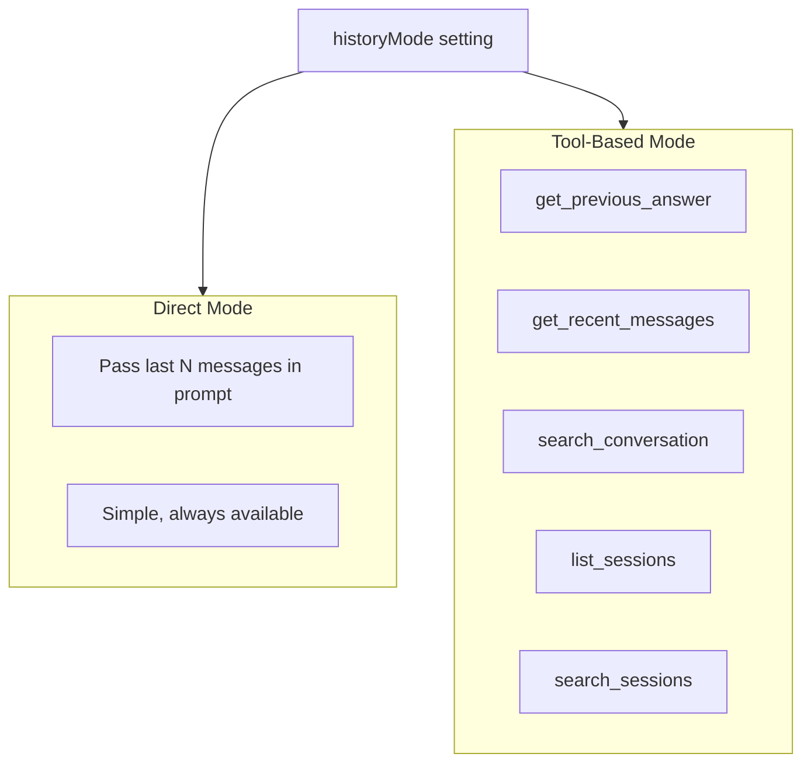
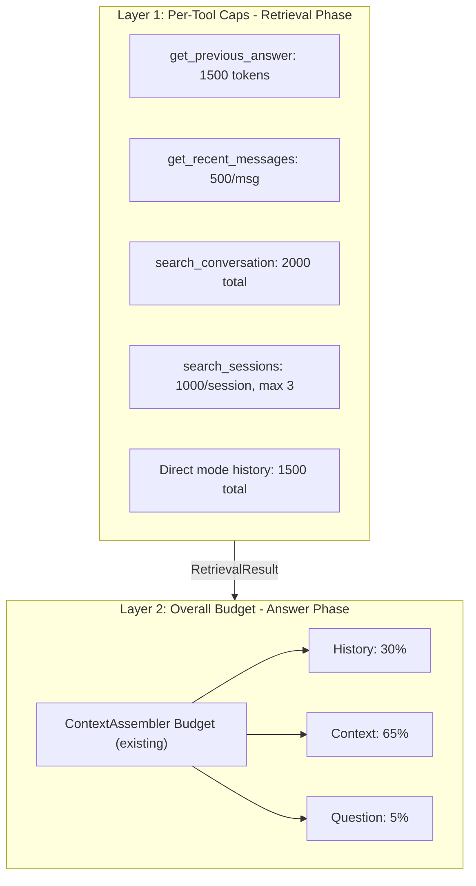

# Conversation History Access for Retrieval Model

## Problem

The tools/retrieval model has no memory of previous conversations. When users ask "Why did you suggest that?" or reference previous answers, the model searches the codebase for code that doesn't exist.

## Solution

Two modes for accessing conversation history:



## Configuration

Add to [src/core/config.ts](src/core/config.ts):

```typescript
// In AIDE_DEFAULTS
historyMode: 'tools' as 'direct' | 'tools',  // Default to tool-based
historyLimit: 6,  // For direct mode: last N messages
```

Add to [src/brain/types.ts](src/brain/types.ts) `RetrievalQuery`:

```typescript
conversationHistory?: ChatMessage[];  // For direct mode
sessionManager?: SessionManager;       // For tool-based mode (cross-session)
```

## Changes

### 1. Add conversation history tools

In [src/retrieval/toolBasedRetrieval.ts](src/retrieval/toolBasedRetrieval.ts), add new tool definitions:

```typescript
// Current session tools
{ name: 'get_previous_answer', description: 'Get the model previous response' },
{ name: 'get_recent_messages', params: { count: number } },
{ name: 'search_conversation', params: { query: string } },

// Cross-session tools
{ name: 'list_sessions', description: 'List available sessions with summaries' },
{ name: 'search_sessions', params: { query: string } },
```

### 2. Implement tool handlers

Add handlers that access session data:

```typescript
case 'get_previous_answer':
  const history = query.conversationHistory || [];
  const lastAssistant = history.filter(m => m.role === 'assistant').pop();
  return { content: lastAssistant?.content || 'No previous answer found' };

case 'search_sessions':
  // Use SessionManager.listSessions() and search through them
  const sessions = SessionManager.listSessions(sessionsDir);
  // Search and return relevant excerpts
```

### 3. Update system prompt

In `buildSystemPrompt`, add conversation tool instructions:

```typescript
if (historyMode === 'tools') {
  prompt += `
CONVERSATION TOOLS:
- get_previous_answer: Get what you said before (use when user asks "why did you suggest X")
- get_recent_messages(count): Get last N messages from this chat
- search_conversation(query): Search current conversation
- list_sessions: See all available sessions
- search_sessions(query): Search across all sessions for relevant context
`;
}
```

### 4. Direct mode fallback

For direct mode, include history in initial messages:

```typescript
if (historyMode === 'direct' && query.conversationHistory?.length) {
  messages.push({
    role: 'system',
    content: `PREVIOUS CONVERSATION:\n${formatHistory(
      query.conversationHistory
    )}`,
  });
}
```

### 5. Add UI toggle for history mode

In [web/src/App.tsx](web/src/App.tsx), add toggle similar to strategy selector:

```typescript
// State
const [historyMode, setHistoryMode] = useState<'direct' | 'tools'>('tools');

// UI - add near strategy selector
<div className="history-mode-toggle">
  <label>History Mode:</label>
  <select value={historyMode} onChange={e => setHistoryMode(e.target.value)}>
    <option value="tools">Tool-based (on-demand)</option>
    <option value="direct">Direct (always include)</option>
  </select>
</div>
```

Pass to server via WebSocket message options:

```typescript
// In sendQuestion()
ws.send(JSON.stringify({
  type: 'question',
  content: question,
  options: { strategy, historyMode, verbose }
}));
```

### 6. Pass context from callers (server)

In [src/web/server.ts](src/web/server.ts) and [src/cli/repl.ts](src/cli/repl.ts):

```typescript
const result = await retrieval.retrieve(
  {
    question,
    focusSymbolIds: currentSession.getFocusSymbolIds(),
    focusFileIds: currentSession.getFocusFileIds(),
    // For direct mode
    conversationHistory:
      settings.historyMode === 'direct'
        ? currentSession.getHistory().slice(-settings.historyLimit)
        : undefined,
    // For tool-based mode (cross-session search)
    sessionManager:
      settings.historyMode === 'tools' ? sessionManager : undefined,
  },
  currentStore
);
```

## Token Management

Two-layer token budget architecture:



### Layer 1: Per-Tool Caps (New)

Add to [src/retrieval/toolBasedRetrieval.ts](src/retrieval/toolBasedRetrieval.ts):

```typescript
const CONVERSATION_TOOL_LIMITS = {
  get_previous_answer: 1500,    // Last response, truncated
  get_recent_messages: 500,     // Per message
  search_conversation: 2000,    // Total for search results
  search_sessions: 1000,        // Per session, max 3 sessions
  direct_history: 1500,         // For direct mode total
};
```

Tool handlers use `budget.truncate()` to enforce limits:

```typescript
case 'get_previous_answer':
  const answer = lastAssistantMessage?.content || '';
  return budget.truncate(answer, CONVERSATION_TOOL_LIMITS.get_previous_answer);
```

### Layer 2: Overall Budget (Existing)

Already implemented in [src/core/tokenBudget.ts](src/core/tokenBudget.ts):

```typescript
allocate(usedTokens: number): BudgetAllocation {
  return {
    history: Math.floor(available * 0.3),  // 30%
    context: Math.floor(available * 0.65), // 65%
    question: Math.floor(available * 0.05), // 5%
  };
}
```

Used by [src/context/assembler.ts](src/context/assembler.ts) to enforce final context size.

### Why Two Layers

| Layer | Purpose | Prevents |

|-------|---------|----------|

| Per-tool caps | Bound individual results | One tool blowing up context |

| Overall budget | Final assembly limit | Total exceeding model limit |

## Token Efficiency

| Mode | Tokens Used | When to Use |

|------|-------------|-------------|

| Direct | Always ~500-1000 | Simple setups, short conversations |

| Tools | Only when needed | Long conversations, cross-session needs |

## Implementation Order

1. Add `historyMode` and `historyLimit` settings to config
2. Add `conversationHistory` and `sessionManager` fields to RetrievalQuery
3. Add `CONVERSATION_TOOL_LIMITS` for per-tool token caps
4. Implement direct mode (simpler)
5. Add conversation tools to RETRIEVAL_TOOLS
6. Implement tool handlers with token truncation
7. Add cross-session search capability (list_sessions, search_sessions)
8. Add history mode toggle to web UI
9. Update callers (server, CLI) to pass appropriate context based on mode