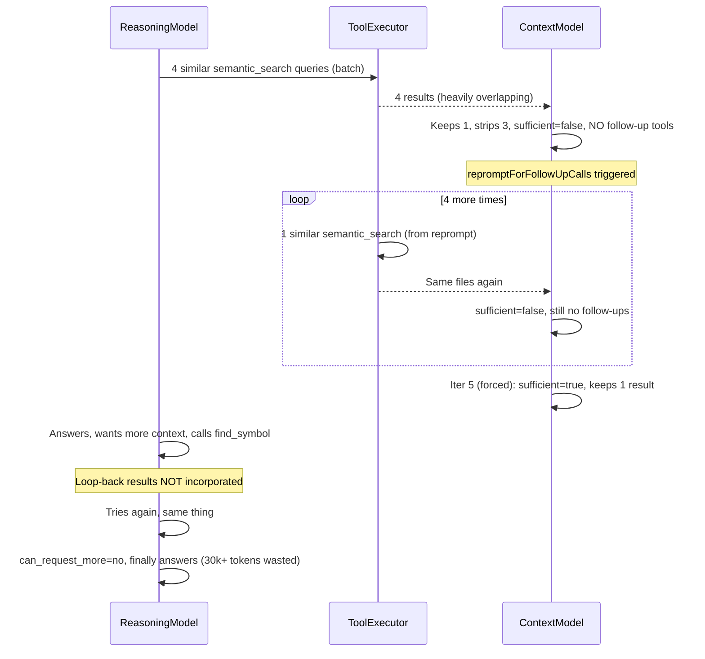

# Orchestration Loop Refinement

## Diagnosis

From the [session log](/Users/meky/.aide/projects/f126df15177d/logs/session-2026-02-13T14-24-31-947Z.log), the flow was:



**Root causes identified (7 distinct issues):**

1. **Planning model fires 4 near-identical semantic_search calls.** Dedup only catches exact arg hashes. "verbose log click scrolls to bottom of list" vs "scrollIntoView verbose log item click" are different hashes but return 90% the same results.
2. **Context model never batches follow-up tools with report_evaluation.** Every iteration: report_evaluation only, no other tools. This triggers `repromptForFollowUpCalls()` which generates another weak semantic_search.
3. `**repromptForFollowUpCalls()` has no memory. It sends a fresh message without the accumulated results or previous-call list, so it always generates a generic semantic_search.
4. **No semantic similarity dedup.** Tool calls like `semantic_search({"query":"verbose log click..."})` and `semantic_search({"query":"verbose log click scrolls..."})` are treated as distinct.
5. **Results not consolidated before evaluation.** The context model sees 4 separate result blocks with 80% overlapping file:line ranges (App.tsx:762-797 appears in ALL four). This makes evaluation harder and wastes tokens.
6. **Reasoning loop-back doesn't incorporate results.** When the answering model requests more context (find_symbol, semantic_search), the code runs execute/evaluate but the curated context in the next answering prompt is identical -- the new results are getting stripped or not added.
7. **Sufficiency criteria too vague.** The context model has no concrete framework for when to declare sufficient=true, leading to 5 iterations of "not sufficient" despite having the answer (App.tsx:409-435 showing the scrollIntoView useEffect).

---

## Architecture Assessment

The reasoning+context model split is **architecturally sound**. It is NOT the root cause. The issues are:

- Prompts lack concrete decision frameworks
- Missing code-level guards for degenerate behavior (similar queries, result overlap)
- A bug in the loop-back path
- Missing result consolidation step

---

## Changes

### 1. Semantic Similarity Guard for Search Queries

**File:** [src/orchestration/orchestrator.ts](src/orchestration/orchestrator.ts)

Add `filterSimilarSearchCalls()` that runs **before** `executeBatch()`. For any `semantic_search` calls in a batch, compute pairwise word-overlap (Jaccard similarity on lowercased word tokens). If overlap > 0.6, keep only the most distinct queries.

Also check against `state.previousCalls` -- if a new semantic_search query has > 0.6 word overlap with any previously executed semantic_search query, skip it.

```typescript
private computeQuerySimilarity(q1: string, q2: string): number {
  const tokenize = (s: string) => new Set(s.toLowerCase().split(/\s+/));
  const s1 = tokenize(q1), s2 = tokenize(q2);
  const intersection = new Set([...s1].filter(w => s2.has(w)));
  const union = new Set([...s1, ...s2]);
  return intersection.size / union.size; // Jaccard
}

private filterSimilarSearchCalls(
  calls: ToolCallSpec[],
  previousCalls: Map<string, ToolCallResult>
): ToolCallSpec[] {
  // Filter within batch: keep only distinct semantic_search queries
  // Filter against previous: skip queries too similar to already-executed ones
  // Non-semantic-search calls pass through unchanged
}
```

Call this in two places:

- After planning model returns tool calls (line ~238)
- After context model returns follow-up tool calls (line ~401)

This is a **code guard**, not a hard limit. The model can still make multiple semantic searches if the queries are genuinely different (e.g., "authentication middleware" vs "database connection pooling").

### 2. Result Consolidation Before Evaluation

**File:** [src/orchestration/orchestrator.ts](src/orchestration/orchestrator.ts)

Add `consolidateResults()` that runs **before** `evaluateWithContextModel()`. This merges results that reference overlapping file:line ranges into a single consolidated result, regardless of which tool produced them.

Currently `safetyNetDedup()` (line 1021) does something similar but only merges at the result level. The new consolidation should:

- Group all file:line chunks across all results by file path
- Merge overlapping/adjacent ranges (within 10 lines)
- Produce a unified per-file view: "web/src/App.tsx: lines 165-174 (from 3 searches), lines 409-435, lines 762-797"
- Reduce the number of result indices the context model needs to evaluate

This replaces the current approach where the context model sees the same App.tsx:762-797 snippet in 4 separate result blocks.

### 3. Planning Prompt Refinement

**File:** [src/orchestration/prompts.ts](src/orchestration/prompts.ts), `buildPlanningPrompt()` (line 46)

Replace the current IMPORTANT GUIDELINES block (lines 62-72) with:

```
IMPORTANT GUIDELINES:
- Your PRIMARY goal is to identify the relevant files and entry points.
- Use 1-2 DIVERSE semantic_search queries that target DIFFERENT aspects of the question.
  Good: "scrollIntoView auto scroll behavior" + "verbose log panel toggle expand" (different angles)
  Bad: 4 queries that are variations of the same phrase
- After semantic_search identifies files and line ranges, include drill-down tools in the SAME batch:
  - read_lines to see the actual code at entry points
  - read_file_outline to understand file structure
  - find_symbol to look up specific function/variable names
- Batch DIVERSE calls together: 1-2 semantic_search + 1-2 read_lines/find_symbol = effective batch
  Do NOT batch 4+ semantic_search calls with similar queries.
- topK guidance: 4-6 for focused queries, 6-8 for broader questions
- The results will be evaluated by another model that decides what is relevant
```

Key change: guide toward diverse queries + mixed tool types in a single batch, rather than "Call ALL tools you need in a single batch (prefer 3-5 targeted calls)" which encourages shotgunning semantic_search.

### 4. Context Evaluation Prompt Refinement

**File:** [src/orchestration/prompts.ts](src/orchestration/prompts.ts), `buildContextEvaluationPrompt()` (line 169)

Replace the "How to Respond" section (lines 231-244) with a concrete decision framework:

```
## Decision Framework
Think step by step before calling report_evaluation:

1. SCAN results for code that relates to the user's question. Look for:
   - Function/component names that match the behavior described
   - Event handlers, effects, or lifecycle hooks related to the issue
   - The code may not use the user's exact words (e.g., a useEffect with scrollIntoView IS "scrolling behavior")

2. DECIDE sufficiency:
   - sufficient=true: You can identify specific file(s) and code that relates to the question,
     even if you don't have every detail. The answering model can request more if needed.
   - sufficient=false: You genuinely cannot identify any relevant code entry point.

3. If sufficient=false, you MUST also call drill-down tools ALONGSIDE report_evaluation:
   - Use read_lines to see more code around entry points you already have
   - Use read_file_outline to understand the structure of files that appear in results
   - Use find_symbol to look up specific function/class names you see in results
   - Do NOT use semantic_search again unless you need a genuinely DIFFERENT concept
   - If you only call report_evaluation without follow-up tools, the system will waste
     an iteration generating a weak search on your behalf

4. IMPORTANT: If previous iterations keep returning the same files and ranges,
   the answer IS in those files. Drill into them with read_lines instead of searching more.
```

Also add an `iteration >= 3` hint: "You are on iteration N. If you still lack context after multiple rounds, the most productive action is to read_lines into the most relevant files you already have, not to search again."

### 5. Fix `repromptForFollowUpCalls()`

**File:** [src/orchestration/orchestrator.ts](src/orchestration/orchestrator.ts), line 1146

Current implementation sends a bare message with no context:

```typescript
const repromptMessage = `You indicated more context is needed but didn't specify follow-up tool calls...`;
```

Fix: include the accumulated results summary and previous call list so the model can make an informed decision:

```typescript
private async repromptForFollowUpCalls(
  query: string,
  state: IterationState
): Promise<ToolCallSpec[] | null> {
  // Build summary of what we already have
  const filesSeen = new Set<string>();
  for (const r of state.relevantResults) {
    // Extract file paths from results
    const filePattern = /([^\s:]+\.[a-zA-Z]+):\d+-\d+/g;
    let match;
    while ((match = filePattern.exec(r.data ?? '')) !== null) {
      filesSeen.add(match[1]);
    }
  }

  const repromptMessage = `You said more context is needed but didn't call any follow-up tools.

Files already found in results: ${[...filesSeen].join(', ')}
Previous calls made: ${Array.from(state.previousCalls.keys()).length} tool calls

Based on the user's question "${query}", call SPECIFIC drill-down tools:
- Use read_lines to look at code in files already found
- Use read_file_outline to understand file structure
- Use find_symbol to look up specific names
Do NOT call semantic_search unless targeting a completely different concept.`;
  // ... rest of implementation
}
```

### 6. Fix Reasoning Model Loop-back

**File:** [src/orchestration/orchestrator.ts](src/orchestration/orchestrator.ts), lines 527-660

The issue: when the reasoning model requests more context during answering, the inner execute/evaluate loop runs but the new results may get stripped by the context model (or the context model may not add them to relevantResults correctly). Then the next answering prompt has identical curated context.

Fix: In the reasoning loop-back path, **bypass full context evaluation** and directly add successful results to `state.relevantResults`. The reasoning model has already decided it needs this specific information -- we should trust that judgment rather than re-filtering through the context model.

```typescript
if (moreToolCalls.length > 0) {
  reasoningLoops++;
  toolCalls = moreToolCalls.slice(0, this.config.maxToolCallsPerBatch);

  // Execute the tools the reasoning model requested
  const results = await this.toolExecutor.executeBatch(
    toolCalls,
    state.previousCalls,
  );
  totalToolCalls += results.length;

  for (const result of results) {
    state.previousCalls.set(result.callKey, result);
  }

  // Trust the reasoning model's judgment: add results directly
  // (no context model re-evaluation for reasoning loop-back)
  for (const r of results) {
    if (r.success && r.data) {
      state.relevantResults.push(r);
    }
  }

  // Dedup before next answering round
  state.relevantResults = this.safetyNetDedup(state.relevantResults);
  continue;
}
```

This removes the inner while loop for reasoning loop-back (lines 538-657) and replaces it with direct incorporation. The context model already evaluated sufficiency -- the reasoning model is now in the answering role and its tool requests should be treated as targeted refinement, not general exploration.

### 7. Answering Prompt `canRequestMore` Refinement

**File:** [src/orchestration/prompts.ts](src/orchestration/prompts.ts), `buildAnsweringPrompt()` line 124

Current text is too permissive. Refine to:

```
IMPORTANT: If the curated context is clearly missing critical information needed to answer
(e.g., a function body is referenced but not shown, a key import is mentioned but the file
isn't included), you can request more by calling tools directly:
- read_lines: to see specific code in a file already referenced
- find_symbol: to look up a specific function or variable
- read_file_outline: to see a file's structure
Prefer targeted read_lines/find_symbol over broad semantic_search.
Only request more if the context is genuinely insufficient -- prefer answering with what you have.
```

---

## Token Impact Estimate

For the example query, these changes would reduce the flow from:

**Before:** 4 semantic_search (planning) + 5 context evaluations + 2 reasoning loop-backs = ~30k tokens
**After:** 2 semantic_search + 1 read_lines (planning) + 1-2 context evaluations + 0-1 loop-back = ~8-12k tokens

---

## Files to Change

- [src/orchestration/prompts.ts](src/orchestration/prompts.ts) -- prompt refinements (todos 3, 4, 7)
- [src/orchestration/orchestrator.ts](src/orchestration/orchestrator.ts) -- similarity guard, consolidation, loop-back fix, reprompt fix (todos 1, 2, 5, 6)
