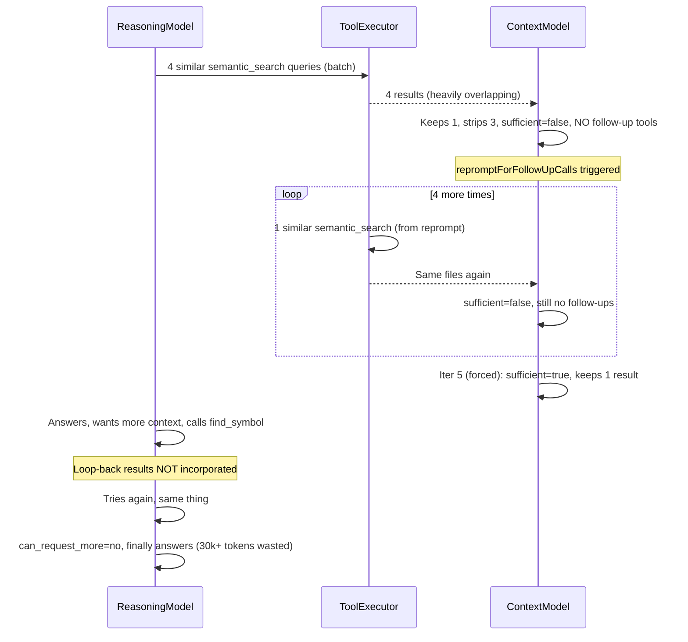

# Orchestration Loop Refinement

## Diagnosis

From the [session log](/Users/meky/.aide/projects/f126df15177d/logs/session-2026-02-13T14-24-31-947Z.log), the flow was:



**Root causes identified (7 distinct issues):**

1. **Planning model fires 4 near-identical semantic_search calls.** Dedup only catches exact arg hashes. "verbose log click scrolls to bottom of list" vs "scrollIntoView verbose log item click" are different hashes but return 90% the same results.
2. **Context model never batches follow-up tools with report_evaluation.** Every iteration: report_evaluation only, no other tools. This triggers `repromptForFollowUpCalls()` which generates another weak semantic_search.
3. `**repromptForFollowUpCalls()` has no memory. It sends a fresh message without the accumulated results or previous-call list, so it always generates a generic semantic_search.
4. **No semantic similarity dedup.** Tool calls like `semantic_search({"query":"verbose log click..."})` and `semantic_search({"query":"verbose log click scrolls..."})` are treated as distinct.
5. **Results not consolidated before evaluation.** The context model sees 4 separate result blocks with 80% overlapping file:line ranges (App.tsx:762-797 appears in ALL four). This makes evaluation harder and wastes tokens.
6. **Reasoning loop-back doesn't incorporate results.** When the answering model requests more context (find_symbol, semantic_search), the code runs execute/evaluate but the curated context in the next answering prompt is identical -- the new results are getting stripped or not added.
7. **Sufficiency criteria too vague.** The context model has no concrete framework for when to declare sufficient=true, leading to 5 iterations of "not sufficient" despite having the answer (App.tsx:409-435 showing the scrollIntoView useEffect).

---

## Architecture Assessment

The reasoning+context model split is **architecturally sound**. It is NOT the root cause. The issues are:

- Prompts lack concrete decision frameworks
- Missing code-level guards for degenerate behavior (similar queries, result overlap)
- A bug in the loop-back path
- Missing result consolidation step

---

## Changes

### 1. Semantic Similarity Guard for Search Queries

**File:** [src/orchestration/orchestrator.ts](src/orchestration/orchestrator.ts)

Add `filterSimilarSearchCalls()` that runs **before** `executeBatch()`. For any `semantic_search` calls in a batch, compute pairwise word-overlap (Jaccard similarity on lowercased word tokens). If overlap > 0.6, keep only the most distinct queries.

Also check against `state.previousCalls` -- if a new semantic_search query has > 0.6 word overlap with any previously executed semantic_search query, skip it.

```typescript
private computeQuerySimilarity(q1: string, q2: string): number {
  const tokenize = (s: string) => new Set(s.toLowerCase().split(/\s+/));
  const s1 = tokenize(q1), s2 = tokenize(q2);
  const intersection = new Set([...s1].filter(w => s2.has(w)));
  const union = new Set([...s1, ...s2]);
  return intersection.size / union.size; // Jaccard
}

private filterSimilarSearchCalls(
  calls: ToolCallSpec[],
  previousCalls: Map<string, ToolCallResult>
): ToolCallSpec[] {
  // Filter within batch: keep only distinct semantic_search queries
  // Filter against previous: skip queries too similar to already-executed ones
  // Non-semantic-search calls pass through unchanged
}
```

Call this in two places:

- After planning model returns tool calls (line ~238)
- After context model returns follow-up tool calls (line ~401)

This is a **code guard**, not a hard limit. The model can still make multiple semantic searches if the queries are genuinely different (e.g., "authentication middleware" vs "database connection pooling").

### 2. Result Consolidation Before Evaluation

**File:** [src/orchestration/orchestrator.ts](src/orchestration/orchestrator.ts)

Add `consolidateResults()` that runs **before** `evaluateWithContextModel()`. This merges results that reference overlapping file:line ranges into a single consolidated result, regardless of which tool produced them.

Currently `safetyNetDedup()` (line 1021) does something similar but only merges at the result level. The new consolidation should:

- Group all file:line chunks across all results by file path
- Merge overlapping/adjacent ranges (within 10 lines)
- Produce a unified per-file view: "web/src/App.tsx: lines 165-174 (from 3 searches), lines 409-435, lines 762-797"
- Reduce the number of result indices the context model needs to evaluate

This replaces the current approach where the context model sees the same App.tsx:762-797 snippet in 4 separate result blocks.

### 3. Planning Prompt Refinement

**File:** [src/orchestration/prompts.ts](src/orchestration/prompts.ts), `buildPlanningPrompt()` (line 46)

Replace the current IMPORTANT GUIDELINES block (lines 62-72). The new prompt must be **generic** -- no examples tied to specific queries. Guide the model toward a natural workflow without overfitting:

```
IMPORTANT GUIDELINES:

STEP 1 - Find entry points:
- Use semantic_search to identify relevant files and code locations
- Make each query target a DIFFERENT aspect or angle of the request
- Avoid making multiple queries that rephrase the same concept

STEP 2 - Gather context from entry points:
- read_lines: read specific code at line ranges found by semantic_search
- read_file_outline: understand file structure (functions, classes, exports)
- find_symbol: look up a specific function, class, or variable by name

STEP 3 - Explore relationships (when graph tools are available):
- get_references: find what calls or uses a symbol
- get_dependencies: find what a symbol depends on

BATCHING:
- Batch calls that are DIVERSE and independent (e.g., a semantic_search + a read_lines + a find_symbol)
- Do NOT batch multiple semantic_search calls with similar queries -- they return similar results
- topK guidance: 4-6 for focused queries, 6-8 for broader questions, 8-12 for surveys

The results will be evaluated by another model that decides what is relevant.
```

Key principles:
- Structured as a natural workflow (find -> gather -> explore) rather than a list of dos/donts
- No query-specific examples that could bias the model
- Batching guidance framed around diversity, not quantity
- Tools listed by purpose, letting the model choose what fits

### 4. Context Evaluation Prompt Refinement

**File:** [src/orchestration/prompts.ts](src/orchestration/prompts.ts), `buildContextEvaluationPrompt()` (line 169)

Replace the "How to Respond" section (lines 231-244). The current prompt is too vague on sufficiency and too specific with examples. The new prompt must be **generic** and frame sufficiency around whether the gathered snippets can fulfill the user's request:

```
## How to Respond

1. Call `report_evaluation` with your assessment:
   - `sufficient`: true/false (see below)
   - `relevantIndices`: indices to KEEP
   - `strippedIndices`: indices to DISCARD

2. If `sufficient=false`, you MUST also call follow-up tools in the SAME response:
   - read_lines: expand or explore code around locations already found
   - read_file_outline: understand the structure of files appearing in results
   - find_symbol: look up specific names you see referenced in results
   - semantic_search: ONLY if you need to explore a genuinely different part of the codebase
   - get_references / get_dependencies: trace how symbols connect

## Evaluating Sufficiency

sufficient=true means: the kept results contain enough code snippets that the answering
model could fulfill the user's request -- answer the question, diagnose the issue, or
understand the relevant code. It does NOT require having every detail; the answering model
can request targeted follow-ups if needed.

sufficient=false means: the kept results do not yet contain the code needed to address the
request, AND you have a concrete idea of what to look for next (which is why you MUST call
follow-up tools alongside report_evaluation).

The code you need may not match the user's exact words. Look at what the code DOES, not
just what it's named.
```

Key differences from previous version:
- **Sufficiency framed as "can fulfill the request"** not "can identify entry points" -- covers questions, bug reports, feature asks, understanding requests
- **No query-specific examples** (removed scrollIntoView/useEffect examples)
- **No "the system will waste an iteration" warning** -- models shouldn't need to know system internals to make good decisions
- **No hard rule about avoiding semantic_search** -- instead framed as "only if genuinely different part of the codebase", which lets the model use judgment
- **No iteration >= 3 forced hint** -- this is risky because the model may legitimately need to shift to a different part of the code on later iterations. Instead, trust the sufficiency framework + the similarity guard (change 1) to prevent degenerate loops
- **Removed prescriptive drill-down ordering** -- model should choose the right tool for its situation

### 5. Fix `repromptForFollowUpCalls()`

**File:** [src/orchestration/orchestrator.ts](src/orchestration/orchestrator.ts), line 1146

Current implementation sends a bare message with no context -- just "You indicated more context is needed but didn't specify follow-up tool calls..." This gives the model nothing to work with, so it falls back to generic semantic_search.

Fix: include the **last set of results** (full content, not just summary), the files found, and previous call list. The model needs to see what it has to decide what to get next:

```typescript
private async repromptForFollowUpCalls(
  query: string,
  state: IterationState
): Promise<ToolCallSpec[] | null> {
  // Include the actual results so the model can reason about what's missing
  const resultsContext = state.relevantResults
    .filter(r => r.success && r.data)
    .map(r => `${r.spec.name}(${JSON.stringify(r.spec.arguments)}):\n${r.data}`)
    .join('\n\n');

  // Extract file paths for quick reference
  const filesSeen = new Set<string>();
  for (const r of state.relevantResults) {
    const filePattern = /([^\s:]+\.[a-zA-Z]+):\d+-\d+/g;
    let match;
    while ((match = filePattern.exec(r.data ?? '')) !== null) {
      filesSeen.add(match[1]);
    }
  }

  // List previous calls so the model knows what was already tried
  const previousCallDescriptions = Array.from(state.previousCalls.values())
    .map(r => `${r.spec.name}(${JSON.stringify(r.spec.arguments)})`)
    .join('\n');

  const repromptMessage = `You indicated more context is needed but didn't call any follow-up tools.

User's request: "${query}"

## Current Results
${resultsContext}

## Files Found
${[...filesSeen].join(', ') || '(none)'}

## Previous Calls (do not repeat)
${previousCallDescriptions}

Based on the results above, call the tools you need to gather missing context.
Available tools: semantic_search, read_lines, read_file_outline, read_file, find_symbol, get_references, get_dependencies, list_files.`;
  // ... rest of implementation
}
```

Key difference: the model gets the **full results content** to reason about, not just a file list summary. This lets it identify specific gaps (e.g., "I see a reference to `toggleLogExpand` at line 165 but need to see the surrounding code") rather than falling back to generic searches.

### 6. Fix Reasoning Model Loop-back

**File:** [src/orchestration/orchestrator.ts](src/orchestration/orchestrator.ts), lines 527-660

The issue: when the reasoning model requests more context during answering, the inner execute/evaluate loop runs but the new results may get stripped by the context model (or the context model may not add them to relevantResults correctly). Then the next answering prompt has identical curated context.

Fix: In the reasoning loop-back path, **bypass full context evaluation** and directly add successful results to `state.relevantResults`. The reasoning model has already decided it needs this specific information -- we should trust that judgment rather than re-filtering through the context model.

```typescript
if (moreToolCalls.length > 0) {
  reasoningLoops++;
  toolCalls = moreToolCalls.slice(0, this.config.maxToolCallsPerBatch);

  // Execute the tools the reasoning model requested
  const results = await this.toolExecutor.executeBatch(
    toolCalls,
    state.previousCalls,
  );
  totalToolCalls += results.length;

  for (const result of results) {
    state.previousCalls.set(result.callKey, result);
  }

  // Trust the reasoning model's judgment: add results directly
  // (no context model re-evaluation for reasoning loop-back)
  for (const r of results) {
    if (r.success && r.data) {
      state.relevantResults.push(r);
    }
  }

  // Dedup before next answering round
  state.relevantResults = this.safetyNetDedup(state.relevantResults);
  continue;
}
```

This removes the inner while loop for reasoning loop-back (lines 538-657) and replaces it with direct incorporation. The context model already evaluated sufficiency -- the reasoning model is now in the answering role and its tool requests should be treated as targeted refinement, not general exploration.

### 7. Answering Prompt `canRequestMore` Refinement

**File:** [src/orchestration/prompts.ts](src/orchestration/prompts.ts), `buildAnsweringPrompt()` line 124

Current text says "prefer answering with what you have" which isn't always right -- sometimes the model genuinely needs more context and should get it. The guidance should be about confidence, not about defaulting to answer:

```
IMPORTANT: If the curated context is missing critical information needed to fulfill the
request (e.g., a function body is referenced but not shown, a key file is mentioned but
not included), you can request more by calling tools directly:
- read_lines: see specific code in a file already referenced
- find_symbol: look up a specific function, class, or variable by name
- read_file_outline: understand a file's structure before drilling in
- semantic_search: find code in a different part of the codebase
Answer if the context is sufficient and you are confident in the response.
Request more only when you can identify a specific gap in the context.
```

Key difference: "Answer if sufficient and confident" vs "prefer answering with what you have". The model should answer when it can do so well, and request more when it has a concrete reason -- not default to either behavior.

---

## Testing Strategy

### Phase 1: Unit Tests (per code change)

Test each code change in isolation before E2E:

**Similarity guard:**
- Test `computeQuerySimilarity()` with known pairs: "verbose log click scroll" vs "verbose log click scrolls to bottom" (high overlap, should be > 0.6), "verbose log click" vs "authentication middleware" (low overlap, should be < 0.3)
- Test `filterSimilarSearchCalls()`: batch of 4 similar semantic_search queries -> should keep 1-2. Batch with 2 diverse queries -> should keep both. Batch with mixed tools -> non-semantic-search calls pass through unchanged.
- Test against previousCalls: new query similar to already-executed one -> filtered. New query dissimilar -> passes.

**Result consolidation:**
- Test with 4 results all referencing overlapping App.tsx ranges -> should consolidate into 1-2 unified results
- Test with results from different files -> no merging, all pass through
- Test with a mix of overlapping and non-overlapping -> correct merge behavior

**Loop-back fix:**
- Test that results from reasoning model's tool requests are added directly to state.relevantResults
- Test that dedup runs after addition (safetyNetDedup)
- Test that the answering prompt changes when new results are incorporated

**Reprompt fix:**
- Test that the reprompt message includes full results content
- Test that the reprompt message includes file list and previous calls
- Test that the model receives enough context to suggest targeted drill-down

### Phase 2: E2E Tests (model combos)

Run all 3 model combinations against all 3 test questions:

**Model combos:**
- reasoning=qwen3-coder:30b + context=qwen3-coder:30b (local-only baseline)
- reasoning=gpt-5.2 + context=qwen3-coder:30b (hybrid)
- reasoning=gpt-5.2 + context=gpt-5.2 (cloud-only)

**Test questions:**
- Q1 (bug report): "When I click on a verbose log, it scrolls me all the way to the bottom of the list unexpectedly"
- Q2 (feature understanding): "How does the retrieval strategy system work?"
- Q3 (follow-up, keep session from Q1): "Show me how to implement the fix you proposed"

**For each run, capture and report:**
- Total tokens (input + output, per model role)
- Number of iterations
- Number of tool calls by type (semantic_search, read_lines, find_symbol, etc.)
- Whether similarity guard filtered any calls (and which)
- Whether result consolidation reduced results (before/after counts)
- Context model sufficiency decisions per iteration (true/false + reasoning)
- Whether reasoning loop-back was triggered and whether it worked
- Full answer text
- Quality assessment: does the answer accurately diagnose the issue / explain the system / reference the prior answer? Cite specific evidence from the answer.

**Success criteria (NOT "it looks good"):**
- Planning model makes <= 3 semantic_search calls total, with genuinely different queries
- Context model reaches sufficient=true within 1-3 iterations (not 5)
- If context model says insufficient, it also calls follow-up tools (no bare report_evaluation)
- No semantic_search queries with > 0.6 Jaccard overlap make it to execution
- Total tokens reduced by >= 40% compared to the baseline log
- Answer quality: correctly identifies relevant code with specific file paths and line numbers
- No regression: answers are at least as accurate as the baseline (which was "accurate but without a solution")

**Iterate until these criteria are met without overfitting to these specific queries.** The prompts must remain generic enough to work for arbitrary codebase questions.

---

## Files to Change

- [src/orchestration/prompts.ts](src/orchestration/prompts.ts) -- prompt refinements (todos 3, 4, 7)
- [src/orchestration/orchestrator.ts](src/orchestration/orchestrator.ts) -- similarity guard, consolidation, loop-back fix, reprompt fix (todos 1, 2, 5, 6)
