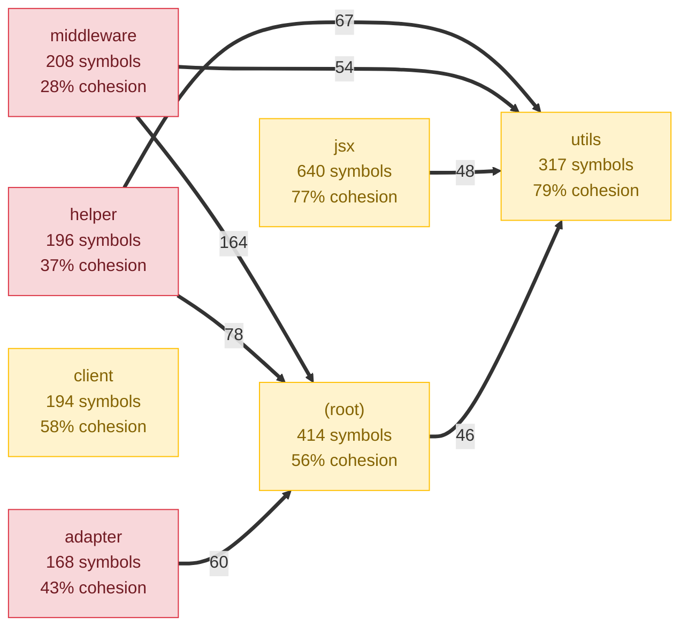

# AIDE v0.3.0 — Product Evaluation & Demo Results

> Evaluated February 26, 2026 against 4 real-world repos:
> - **Hono** (TypeScript framework, 392 files, 2324 symbols)
> - **Express** (JavaScript framework, 146 files, 227 symbols)
> - **Flask** (Python framework, 92 files, 1940 symbols)
> - **Bubbletea** (Go TUI library, 152 files, 1676 symbols)

---

## Quick Summary: Where's the Value?

| Product | Command | Value Rating | Honest Assessment |
|---------|---------|-------------|-------------------|
| Health Score | `aide scan` | Medium | Plausible for TS. Misleading for non-TS (Go gets 93/100 with zero relations) |
| Rules | `aide rules` | Low | Auto-generated rules just mirror current state. Not prescriptive. |
| Check | `aide check` | Medium-High | Best product. Finds real violations with file evidence. But suggestions are generic. |
| MCP | `aide mcp` | Unknown | 6 tools work over JSON-RPC but never tested with a real AI agent. `files` param is broken. |
| Map | `aide map` | Medium | Genuinely useful visualization. Mermaid renders nicely in GitHub. |
| Onboard | `aide onboard` | Low | Data dump. Missing narrative, entry points, and "how to navigate" guidance. |
| Stats | `aide stats` | Supporting | Quick overview. Only valuable if core (scan/check) is valuable. |
| Trend | `aide trend` | Supporting | Tracking over time. No data to show yet. |
| Diff | `aide diff` | Supporting | Baseline comparison. Useful for CI but not standalone. |
| Export | `aide export` | Supporting | Stakeholder reports. Compiles other products into one doc. |

---

## Product 1: `aide scan` — Health Score

### What it looks like

```
=== AIDE Architecture Scan ===

Health Score: 59/100

  Module Cohesion:    17/30
  Low Coupling:       25/30
  No Circular Deps:    2/20
  Module Balance:      8/10
  Test Coverage:       7/10

Modules (13):
  jsx            640 symbols   77% cohesion
  (root)         414 symbols   56% cohesion
  utils          317 symbols   79% cohesion
  middleware     208 symbols   28% cohesion  ← low
  helper         196 symbols   37% cohesion  ← low
  client         194 symbols   58% cohesion
  adapter        168 symbols   43% cohesion
  router          59 symbols   41% cohesion
  ...

Circular Dependencies: 35 cycles
```

### Honest Assessment

**On Hono (TypeScript)**: Score 59/100 is plausible. 2,188 relations detected, 35 circular dependency cycles found. The breakdown tells you coupling is fine (25/30) but circular deps are killing the score (2/20). That's actionable information.

**On Flask (Python)**: Score 83/100 is MISLEADING. Only 162 relations detected for 1,940 symbols. The high score is because ctags can't detect Python import relationships deeply — so there's no coupling or cycles to penalize. It looks "healthy" because we're blind.

**On Bubbletea (Go)**: Score 93/100 is BROKEN. Zero relations detected. 100% cohesion everywhere because there are no cross-module dependencies visible. This is a false positive — we're scoring a repo we can't analyze.

**The breakdown IS where the value is** — a developer looking at "cohesion 17/30, circular 2/20" knows exactly where to focus. But only for TypeScript/JavaScript repos.

**What's missing**: A "confidence" indicator. If relations/symbols < 0.05, the score should say "LOW CONFIDENCE — limited relation detection for this language."

---

## Product 2: `aide rules` — Architecture as Code

### What it looks like (auto-generated for Hono)

```yaml
version: "1"

modules:
  - name: jsx
    patterns: ["src/jsx/**/*"]
    description: "640 symbols, cohesion: 77%"
  - name: utils
    patterns: ["src/utils/**/*"]
    description: "317 symbols, cohesion: 79%"
  - name: middleware
    patterns: ["src/middleware/**/*"]
    description: "208 symbols, cohesion: 28%"
  ...

boundaries:
  - from: jsx
    allow: [benchmarks, helper, middleware, router, runtime-tests, utils]
  - from: middleware
    allow: [adapter, benchmarks, helper, jsx, router, runtime-tests, utils]
  ...

constraints:
  - id: no-circular-deps
    type: no-circular-deps
    severity: error
  - id: max-coupling
    type: max-coupling
    params: { max: 50 }
    severity: warning
```

### Honest Assessment

**The problem**: These rules are purely descriptive. Look at `middleware` — it's allowed to import from 7 other modules because it currently does. If middleware currently has bad architecture, the auto-generated rules just codify the bad architecture.

This means:
- A new developer adding a NEW dependency from `middleware` to a module NOT in the list would trigger a violation (good)
- A developer adding MORE coupling between already-connected modules would NOT trigger anything (bad)
- The rules don't say what SHOULD be — they say what IS

**What would make this valuable**:
- Intelligent tightening: if a module only has 1-2 relations to another, don't add it to `allow` (likely accidental coupling)
- Detect layering patterns and generate `deny` rules (e.g., `brain` should never import from `cli`)
- Comments telling users "EDIT THIS FILE to set your intended architecture"
- Module descriptions should describe purpose, not just "640 symbols, cohesion: 77%"

---

## Product 3: `aide check` — Architecture Enforcement

### What it looks like (Hono)

```
=== AIDE Architecture Check ===

  ✗ [error] Circular dependency: (root) → utils → (root)
    Fix: Break the cycle by removing the weakest link: "utils" → "(root)" (10 relations).
    Extract shared types to a common module, or invert the dependency with DI.

  ✗ [error] Circular dependency: helper → jsx → helper
    Fix: Break the cycle by removing the weakest link: "helper" → "jsx" (11 relations).
    Extract shared types to a common module, or invert the dependency with DI.

  ⚠ [warning] Module coupling "middleware" → "(root)": 164 relations (max: 50)
    Top sources: src/middleware/bearer-auth/index.ts (4 relations),
                 src/middleware/basic-auth/index.ts (3 relations),
                 src/middleware/basic-auth/index.test.ts (2 relations)
    Fix: Reduce coupling by extracting a shared interface or facade.

  ⚠ [warning] Module coupling "helper" → "(root)": 78 relations (max: 50)
    Top sources: src/helper/cookie/index.ts (4 relations),
                 src/helper/accepts/accepts.ts (2 relations)
    Fix: Reduce coupling by extracting a shared interface or facade.

  35 errors, 5 warnings | Score: 59/100
```

### Honest Assessment

**What's good**:
- Finds real violations with specific file names
- Coupling warnings name the exact top-contributing files
- "Weakest link" for circular deps tells you which edge has fewest relations (easiest to break)
- Incremental mode (`--changed`, `--since`) filters to affected modules only — great for CI

**What's NOT good**:
- 35 circular dep errors is too noisy. Developers will ignore this.
- Fix suggestions are templated, not contextual: "Extract shared types to a common module" — WHICH types? WHERE?
- No line numbers. The `line` field exists in the Violation type but is never populated.
- For circular deps, it doesn't tell you WHICH SPECIFIC IMPORTS create the cycle — just module names.

**The question: Is this just ESLint?**

| Aspect | AIDE `check` | `eslint-plugin-import/no-cycle` |
|--------|-------------|-------------------------------|
| Granularity | Module-level (coarse) | File-level, line-level (precise) |
| Actionability | "Break brain → analysis" | "Remove this import at line 5" |
| Cross-module coupling | Yes — quantified | No |
| Weakest link suggestion | Yes | No |
| Incremental (git-aware) | Yes (`--changed`, `--since`) | No (whole project or nothing) |
| Cross-language | Theoretically yes | JS/TS only |

**AIDE differentiates on**: module-level architectural view, coupling quantification, weakest-link analysis, git-aware incremental checking. ESLint is better for: "which exact import do I delete on which line?"

The real gap: AIDE should ALSO tell you which specific files/imports to change, not just which modules are involved.

---

## Product 4: `aide mcp` — AI Agent Layer

### What tools exist (6 total)

| Tool | Input | What It Returns | Agent Value |
|------|-------|----------------|-------------|
| `check_compliance` | `{ files?: string[] }` | Pass/fail, health score, violations | **Medium** — but `files` param is A NO-OP BUG. Always checks entire project. |
| `find_similar` | `{ query: string, limit?: number }` | Matching symbols + code blocks | **Low** — substring grep, not semantic search. Asks for "authentication middleware" only finds literal matches. |
| `get_architecture` | `{}` | Full overview: modules, deps, rules, health | **High** — best tool. Agent gets full project context. |
| `scan_health` | `{}` | Health score breakdown | **Low** — subset of `get_architecture`. Redundant. |
| `get_module_info` | `{ module_name: string }` | Module symbols, deps, cohesion, allowed imports | **Medium-High** — useful before modifying a module. |
| `suggest_fix` | `{ focus?: 'all'\|'circular'\|'coupling'\|'boundary' }` | Prioritized violations with suggestions | **Low** — suggestions are generic. |

### What's missing for real agent value

1. **`check_file` or `check_diff`** — Agent needs to check if a SPECIFIC change violates rules. The broken `files` param means this doesn't work.
2. **`get_imports_for_file`** — "What can this file import? What's off-limits?" File-level boundary guidance.
3. **`find_where_used`** — "If I change this function, what breaks?" Impact analysis.
4. **`get_conventions`** — "What naming/style/patterns does this project use?" This is what agents need most.
5. **Real semantic search** — `find_similar` should use the embeddings that already exist in the DB, not substring matching.

### MCP Protocol Test

The server initializes correctly and responds to `tools/list` over JSON-RPC 2.0 on stdio:

```json
{
  "result": {
    "protocolVersion": "2024-11-05",
    "serverInfo": { "name": "aide-architecture", "version": "0.3.0" },
    "tools": [
      { "name": "check_compliance", ... },
      { "name": "find_similar", ... },
      { "name": "get_architecture", ... },
      { "name": "scan_health", ... },
      { "name": "get_module_info", ... },
      { "name": "suggest_fix", ... }
    ]
  }
}
```

**Verdict**: Protocol works. Tool quality is 4/10. The `get_architecture` and `get_module_info` tools provide genuine context. Everything else needs work.

---

## Product 5: `aide map` — Dependency Visualization

### What it looks like (Mermaid format for Hono, renders in GitHub)



### ASCII format (terminal)

```
Modules:
  Name            Symbols  Cohesion  Dependencies
  ---------------------------------------------------------------
  jsx                 640       77%  →utils(48) →helper(42) →middleware(19) →(root)(18)
  (root)              414       56%  →utils(46) →middleware(21) →helper(8) →jsx(5)
  utils               317       79%  →middleware(12) →(root)(10) →helper(9)
  middleware          208       28%  →(root)(164) →utils(54) →helper(26) →jsx(7)
  helper              196       37%  →(root)(78) →utils(67) →middleware(15) →jsx(11)
```

### What it looks like for a clean project (Flask)

```
Dependency Matrix:
               test flas exam docs
  tests         ·     11    -    -
  flask           -  ·      -    -
  examples        -    -  ·      -
  docs            -    -    -  ·
Health Score: 83/100
```

### Honest Assessment

**Good**: Mermaid output is genuinely useful — paste into a README/PR and the architecture is visible. Color coding (green/yellow/red by cohesion) is intuitive. Arrow thickness by relation count shows where the coupling is.

**Is this how we imagined it?** Mostly yes for the data. The Mermaid graph on a real project like Hono (13 modules) is readable and shows the hot spots. On smaller projects (Flask, Express) the dependency matrix is clean and informative.

**What's missing**: Interactive version. The static Mermaid/ASCII is useful for documentation but a web-based interactive graph where you can click modules and drill down would be the real visualization product. That said, for v0.3.0, the static output delivers value.

---

## Product 6: `aide onboard` — Architecture Guide

### What it looks like (excerpt for Hono)

```markdown
# hono — Architecture Guide

## Project Overview
| Metric | Value |
|--------|-------|
| Files | 392 |
| Symbols | 2324 |
| Relations | 2188 |
| Health Score | 59/100 |

## Module Map

### jsx
- **Files**: 45
- **Symbols**: 640
- **Cohesion**: 77%
- **Depends on**: utils (48), helper (42), middleware (19), (root) (18)
- **Used by**: helper (11), runtime-tests (7), middleware (7)

**Key symbols:**
- `function` **fnElement**: `const fnElement = (`
- `class` **JSXNode**: `export class JSXNode implements HtmlEscaped`
- `function` **jsx**: `export const jsx = (`
...
```

### Honest Assessment

**This is a data dump, not an architecture guide.**

What it does: Lists modules with their metrics and key symbols. Technically accurate.

What a new developer actually needs:
- "Hono is a web framework. Start by looking at `src/hono.ts` — that's the main entry point."
- "The `middleware` module contains all HTTP middleware. To add new middleware, follow the pattern in `src/middleware/cors/`."
- "The `jsx` module handles server-side JSX rendering. It's the largest module and has the most coupling — be careful adding dependencies here."
- "Common patterns: middleware uses `createMiddleware()` factory, routes use `app.get()` method chaining."

None of this narrative exists. The onboard doc is structurally identical to `aide stats -v` output but longer.

**Key sections mentioned in source code comments but NEVER GENERATED:**
- "Key Entry Points (main exports, public APIs)" — not implemented
- "Architecture Patterns" — not implemented

---

## Product 7-10: Supporting Tools

### `aide stats`
Quick overview. Useful as a dashboard but not standalone product value.

### `aide trend`
Health tracking over time. Requires `--record` to save data points. No data to show in demos since these are fresh repos. Sparkline chart is a nice touch for long-running projects.

### `aide diff`
Baseline comparison. Useful for CI ("did this PR make architecture worse?"). No demo possible without a saved baseline.

### `aide export`
Compiles everything into a stakeholder-ready markdown report with Mermaid graphs, health breakdown, violations. Good for architecture reviews but it's just packaging the other products.

---

## Cross-Cutting Issues

### Circular Deps: Don't devs already have this?

**Yes, partially.** `eslint-plugin-import/no-cycle`, `madge`, and `dependency-cruiser` all detect circular dependencies at the file level. AIDE detects them at the module level.

**What AIDE adds**: Module-level grouping ("the analysis module and the rules module have a circular dependency") and weakest-link analysis ("break it by removing the 6 relations from analysis → rules"). ESLint would show you 6 individual violations without grouping them.

**What AIDE is missing**: The specific imports. ESLint says "line 5: circular import detected." AIDE says "these two modules are circular" but doesn't say which specific import statements to remove.

**Net assessment**: AIDE's circular dep detection is a different abstraction (architecture level vs file level). Both are useful. AIDE is NOT a replacement for ESLint but a complement. The value is in the architectural view, not the per-file precision.

### The "Rules Continue Bad Practices" Problem

**Yes, this is exactly right.** Auto-generated rules from a codebase with bad architecture just codify the bad architecture. The boundaries section says "middleware can import from [7 modules]" because it currently does — not because it should.

**The intended workflow (not communicated):** Auto-generate → human edits to set INTENDED architecture → machine enforces. But the tool never tells users to edit the rules. It generates them and moves on.

### Non-TS Languages: Misleading Scores

| Repo | Language | Relations | Score | Is Score Meaningful? |
|------|----------|-----------|-------|---------------------|
| Hono | TypeScript | 2,188 | 59/100 | Yes — deep analysis |
| Express | JavaScript | 118 | 42/100 | Partially — no `require()` support |
| Flask | Python | 162 | 83/100 | No — mostly blind to coupling |
| Bubbletea | Go | 0 | 93/100 | No — completely blind |

---

## Bottom Line

**One product delivers clear value**: `aide check` in CI for TypeScript projects. It catches real violations, names specific files, and the incremental mode is genuinely useful.

**Two products deliver moderate value**: `aide scan` (the breakdown is useful) and `aide map` (visualization is useful).

**Everything else is either**: broken (MCP `files` param), misleading (non-TS scores), a data dump (onboard), or self-defeating (rules that codify bad practices).

**The path to real value**:
1. Fix the bugs (MCP files param, semantic search)
2. Make rules prescriptive (tighten boundaries, add deny rules)
3. Make suggestions actionable (specific files and imports, not generic advice)
4. Add confidence warnings for non-TS languages
5. Then build new capabilities (style intelligence, convention extraction)
